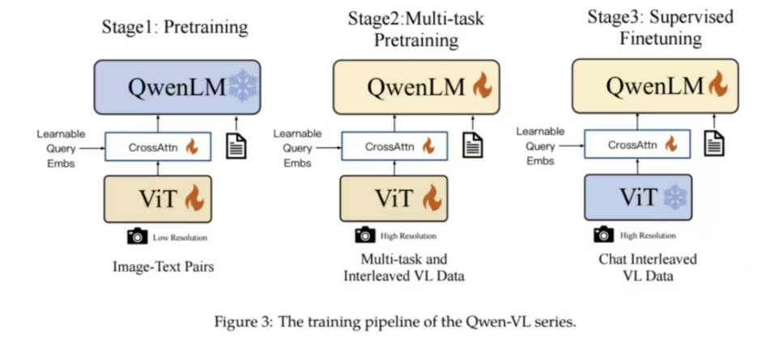

# Qwen-VL: A Versatile Vision-Language Model for Understanding, Localization, Text Reading, and Beyond (2024.8.27)
by Alibaba Group

"What's more, as real-world visula scenarios are quite complicated fine-grained visual understanding plays a crucial role for LVLMs to assist people effectively and precisely.But only a few attempts had been made toward this direction, the majority of open-source LVLMs remain perceiving the image in a coarse-grained approach and lacking the ability to execute fine-grained perception such as object grouding or text reading"

## The method of training model:
A 3-stage training pipeline to optimize the whole model upon a vast collection of image-text corpus.
1. Stage1: Pretraining  
2. Multi-task Pretraining  
3. Suipervised Finetuning  

## Innovation point: 
1. a new visual receptor (with a new encoder and position-aware adapter)

## Future direction:
1. integrating Qwen-VL with more modalities, such as speech and video  
2. Augmenting Qwen-VL by scaling up the model size, training data and higher resolution, enabling it to handle more complex and intricate relationships within multimodal data  
3. Expanding Qwen-VL's prowess in multi-modal geneartion, specifically in generating high-fidelity images and fluent speech.

## Comment
This paper show a new version of Qwen-LM. This paper add a new visual receptor to the model. So a model with powerful performance appeared.Then they use a 3 Stage method to train their model. Finally, they use some QA-methods to evaluate model performance just like data analysis.

Today, although there are still many new models born, more model are working based former models.They could add something to enhance their performance. 

In this way, the study of LLMs is also similar to general science research.Just like the program of preservation technology of composite films. Combine some old material to create a new items.So i could also deep the process of scientific study.

We could conclude a research process from this paper.   
1. Find a direction which may enhance performance  
2. Design something new   
3. Use some methods to train the model  
4. Use some methods to test model performance  
5. Come to a conclusion  
In this way, we could find out from which aspects to start.  
1. Find some new model or find which model have potential.  
2. Find new method to enhance model.(Most important)  
3. Find new method to train model  
4. Find new method to test model  